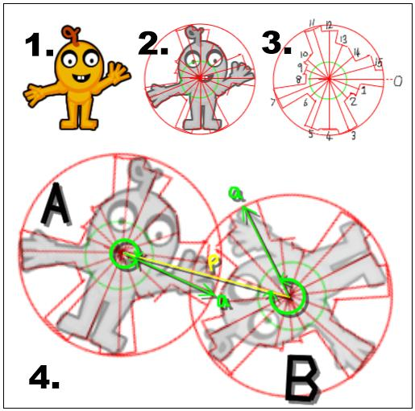

Fast almost pixel perfect collision can be achieved by defining the shape of each sprite with a set of polar coordinated. Each coordinate describes the distance from the center (the center is arbitrary but must be inside the sprite) and direction from the center of the furthest most pixel from the center along that direction. The number of coordinates (n) is determined by the circumference of the outermost pixel. 

https://stackoverflow.com/questions/36012563/how-to-do-pixel-perfect-collision-detection-of-two-partially-transparent-images

